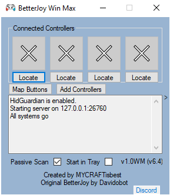

  

# BetterJoy Win Max v1.0 (based off source code from BetterJoy v6.4α)

This version of BetterJoy is intended primarily for use with a GPD Win Max internal gamepad and a Left Joycon to hijack the Rumble and gyro features from it for use on the GPD Win Max handheld computer.

Allows the GPD Win Max (or any Xinput controller in the first controller slot) to merge with a JoyCon or Pro Controller for rumble and gyro use.
It also allows using the gyro to control your mouse and remap the special buttons (SL, SR, Capture) to key bindings of your choice.

If anyone would like to donate, [you can do so here](https://www.paypal.me/RichardGordonson).

If you want to donate to the original BetterJoy project, [click here](https://www.paypal.me/DavidKhachaturov/5). 

### Screenshot

# Downloads
Go to the [Releases tab](https://github.com/MYCRAFTisbest/BetterJoy-Win-Max/releases/)!

# How to use

[Youtube Tutorial (todo)](https://www.youtube.com/MYCRAFTisbest)

1. Install drivers
    1. Read the READMEs (they're there for a reason!)
    1. Run *Drivers/ViGEmBus_Setup_1.16.116.exe*
2. Run *BetterJoyForCemu.exe*
3. Connect your controllers.

You can use the pro controller and Joycons as normal xbox controllers on your PC - try it with Steam!

# More Info
For questions and feedback related to BetterJoy Win Max features, [visit the discord](https://discord.com/invite/XNUFgft)

For things related to the original BetterJoy, check out the [wiki](https://github.com/Davidobot/BetterJoy/wiki)! There, you'll find all sorts of goodness such as the changelog, description of app settings, the FAQ and Problems page, and info on how to make BetterJoy work with Steam *better*.

# Connecting and Disconnecting the Controller
## Bluetooth Mode
 * Hold down the small button (sync) on the top of the controller for 5 seconds - this puts the controller into broadcasting mode.
 * Search for it in your bluetooth settings and pair normally.
 * To disconnect the controller - hold the home button (or capture button) down for 2 seconds (or press the sync button). To reconnect - press any button on your controller.

## USB Mode
 * Plug the controller into your computer.
 
## Disconnecting \[Windows 10]
1. Go into "Bluetooth and other devices settings"
1. Under the first category "Mouse, keyboard, & pen", there should be the pro controller.
1. Click on it and a "Remove" button will be revealed.
1. Press the "Remove" button

# Acknowledgements

ORIGINAL Acknowledgements

A massive thanks goes out to [rajkosto](https://github.com/rajkosto/) for putting up with 17 emails and replying very quickly to my silly queries. The UDP server is also mostly taken from his [ScpToolkit](https://github.com/rajkosto/ScpToolkit) repo.

Also I am very grateful to [mfosse](https://github.com/mfosse/JoyCon-Driver) for pointing me in the right direction and to [Looking-Glass](https://github.com/Looking-Glass/JoyconLib) without whom I would not be able to figure anything out. (being honest here - the joycon code is his)

Many thanks to [nefarius](https://github.com/ViGEm/ViGEmBus) for his ViGEm project! Apologies and appreciation go out to [epigramx](https://github.com/epigramx), creator of *WiimoteHook*, for giving me the driver idea and for letting me keep using his installation batch script even though I took it without permission. Thanks go out to [MTCKC](https://github.com/MTCKC/ProconXInput) for inspiration and batch files.

A last thanks goes out to [dekuNukem](https://github.com/dekuNukem/Nintendo_Switch_Reverse_Engineering) for his documentation, especially on the SPI calibration data and the IMU sensor notes!

Icons (modified): "[Switch Pro Controller](https://thenounproject.com/term/nintendo-switch/930119/)", "[
Switch Detachable Controller Left](https://thenounproject.com/remsing/uploads/?i=930115)", "[Switch Detachable Controller Right](https://thenounproject.com/remsing/uploads/?i=930121)" icons by Chad Remsing from [the Noun Project](http://thenounproject.com/). [Super Nintendo Controller](https://thenounproject.com/themizarkshow/collection/vectogram/?i=193592) icon by Mark Davis from the [the Noun Project](http://thenounproject.com/); icon modified by [Amy Alexander](https://www.linkedin.com/in/-amy-alexander/).
