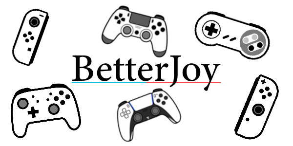

<p align="center">
  
</p>

# BetterJoy² v7.3.0

### Controller freedom, squared.

**BetterJoy² is a free, [MIT-licensed](LICENSE), system-wide controller compatibility layer for
Windows.** It
makes Joy-Cons, Switch Pro, Switch SNES/N64, DualShock 4, and DualSense controllers usable through
standard virtual XInput or DualShock 4 output while preserving the motion, touch, lighting, audio,
adaptive triggers, and device features that make the physical controllers worth owning.

BetterJoy² does not require Steam, an account, online ownership checks, per-machine purchases, or
paid feature tiers. Install it on the computers you own and use your controllers where you want.
It can run independently as a Windows service, including across sign-in sessions and elevated
applications.

The default goal is a clean, conventional virtual controller—not mandatory input remapping. For
people who do want another mapping layer, BetterJoy²'s standard virtual output remains compatible
with Steam Input and other remappers. Optional BetterJoy² profiles provide controller-native
configuration, motion and touch behavior, button chords, and keyboard/mouse actions without making
any of that a prerequisite for ordinary play.

BetterJoy² is growing beyond a collection of fixed controller shortcuts into a composable input
system. Physical buttons, ordered chords, alternative binds, modifiers, touch gestures, and motion
can activate controller, mouse, keyboard, lighting, audio, and hardware actions without generated
outputs feeding back into the real-input state. The goal is simple: bindings should be limited by
the user's imagination, not by collisions between features.

BetterJoy² also provides [Cemuhook](https://sshnuke.net/cemuhook/)/DSU motion for
[Cemu](http://cemu.info/), [Dolphin](https://dolphin-emu.org/), Citra-compatible emulators, and
other compatible applications.

The executable, repository, packages, and filesystem paths retain the ASCII-safe `BetterJoy2`
name where required; **BetterJoy²** is the project and product identity.

## Why BetterJoy² exists

Controller support should behave like a system utility, not like a licensed game. BetterJoy² grew
out of frustration with controller software that requires user intervention, ties access to a storefront, 
limits simultaneous use across a person's own devices, divides hardware support into additional paid
tiers, or requires users to assemble fragile remapping and device-hiding workarounds merely to
avoid double input. 

People should be paid for great software BUT nickle and diming + subscription practice is DISGUSTING!

BetterJoy² takes the opposite approach:

* **Works system-wide** - the controller service does not depend on a game launcher or the GUI
  remaining open, and the optional virtual HID input backend reaches elevated applications and
  Windows session boundaries. Controllers should "Just work" without clunky UIs, startup apps or any nonsense!
* **The software remains yours** - no DRM, account activation, storefront launcher, machine
  entitlement, concurrent-use restriction, or feature DLC. I paid for DSX on Steam and still feel ripped!
* **Remapping is optional** - choose XInput or DualShock 4 output and play, or layer Steam Input or
  another remapper on top when its additional behavior is actually wanted.
* **Double input is handled at the source** - when HidHide is installed, BetterJoy² can manage the
  physical controller's visibility before creating its virtual output, recognizes and rejects its
  own virtual devices during discovery, and provides an explicit unhide-on-exit policy.
* **The implementation is inspectable** - controller protocols, transforms, profiles, service
  behavior, and hardware integrations live in the open repository and can be audited, modified,
  or forked.

# Features

This fork (BetterJoy²) builds heavily on the original BetterJoy - see
[Acknowledgements](#acknowledgements) for the foundation it's built on. Major additions include:

* **FIRST CLASS Nintendo and PlayStation controller support** - Joy-Con pairs or individual halves, Switch Pro,
  Switch SNES/N64, DualShock 4, and DualSense share one controller pipeline with XInput or
  DualShock 4 virtual output. Sony support includes buttons, sticks, analog triggers, battery state,
  rumble, lightbars, touchpads, audio and calibrated gyro/accelerometer motion, plus the DualSense
  Edge FN1/FN2 buttons.
* **Two virtual-controller backends, plus a Passthrough option** - the standard XInput/DualShock 4
  output uses ViGEmBus, or profiles can instead use an alternative backend built on
  [VIIPER](https://github.com/Alia5/VIIPER)/usbip-win2, which adds genuine DualSense virtual
  output - ViGEmBus has no DualSense target at all, so VIIPER is the only way to expose a real
  PS5-shaped virtual controller. A separate Passthrough mode skips virtual output entirely and
  unhides the physical controller instead, so another program (Steam, a game with native
  DualSense/Joy-Con support) can use it directly under its true identity while BetterJoy² keeps
  handling gyro, touchpad, audio, and lighting in the background.
* **Clean physical/virtual device ownership** - integrated and automated HidHide management prevents
  games and remappers from consuming both the physical controller and BetterJoy²'s virtual output.
  BetterJoy² excludes its own virtual devices from discovery and can restore hidden controllers on exit.
* **Gravity-referenced filtered gyro mouse** - a full rework around "Player Space" motion math
  (adapted from GamepadMotionHelpers): yaw/pitch tracked relative to true gravity instead of the
  controller's raw local axes, attempts to keep aiming consistent when the controller is tilted
  or rolled. Includes low-speed tightening, adaptive smoothing, stationary-bias drift correction,
  and orientation-aware grip recentering.
* **Gyro-to-stick** - turn gyro rotation into virtual analog stick input, with three selectable
  modes (Rate, Absolute tilt, Hybrid), per-stick axes, inversion, configurable deflection
  limits, and a ratchet bind for repositioning your wrist mid-turn without it registering as
  reverse input (wip).
* **Touchpad mouse, gestures, and stick output** - DualShock 4 and DualSense touchpads can act as
  relative pointers or floating-origin virtual sticks. Profiles provide separate mouse/stick
  sensitivity, per-axis deflection limits, tap-to-click-and-drag, assignable one and two-finger
  taps, two-finger scrolling, click/scroll actions, activation chords, clenching, pressure lockout,
  and optional inhibition of conflicting controller actions.
* **Silent auto-calibration** - gyro, accelerometer, and stick centers are recalibrated
  automatically in the background the moment a controller is detected sitting genuinely still, no
  wizard or user action required. A guided manual recalibration wizard is still available for
  when it's needed. Auto-calibration is still a WIP. 
* **Runs as a Windows Service** - the core controller pipeline runs independent of the GUI,
  surviving sign-out/sign-in. Works from elevated windows and the Windows lock screen, with
  crash recovery and a session-launched helper so keyboard/mouse actions still work across the
  all service boundaries.
* **Per-controller profiles and composable bindings** - matching profiles per physical controller
  cover virtual output, motion, touch, device behavior, and optional mappings. Bindings support
  physical-only capture, multiple alternatives, and button combinations (chords are exact-match
  and order-sensitive, so a shorter combo doesn't fire while a real superset is held, and HOME+A
  is different from A+HOME). An optional Modifier can inhibit ordinary controller and gyro-mouse
  output while remaining available as a prefix for any number of other actions. Touch gestures,
  mappable shake, and reassignable virtual Guide/PS output use the same input language without
  mapped outputs or button remaps contaminating subsequent bind capture.
* **Custom binds** - map controller chords to virtual controller buttons, keyboard keys and
  shortcuts, mouse buttons, or media/Windows presets, emitted directly on whichever virtual
  controller the profile uses. Rebind mode instead replaces one or more buttons outright, consuming
  their normal output. Bindings are displayed with model-aware PlayStation, Nintendo, Xbox,
  keyboard, and media glyphs rather than raw button names.
* **Controller-owned hardware behavior** - profile-scoped rumble, lightbar colors (a fixed color,
  an automatic Battery mode that shows charge as green/yellow/red bands, an invisible touchpad
  color wheel usable as an exclusive held action or a latched overlay alongside ordinary touchpad
  and gyro controls, a Default mode that leaves lighting entirely untouched for another program
  or the controller's own power-on default to control, or a Disabled mode that forces it off),
  bindable brightness controls, an independent Player LED toggle for
  the small player-number indicator LEDs (DualSense, Joy-Con, Pro, SNES, and N64), battery
  percentage/status, Bluetooth disconnect with a configurable hold-to-power-off duration,
  headphone-jack detection and routing, gyro recentering, and controller-specific calibration
  remain attached to the physical device rather than being reduced to generic remapping concepts.
* **Sony connection and power handling** - a per-profile preferred transport keeps either the
  Bluetooth link (leaving the cable for charging) or the USB connection when both are present.
  Repair mode restores a DualSense's Bluetooth connection to this PC after it has been paired with
  another device (a PS5, another PC, a phone): plugging it in over USB rewrites the controller's
  bond back to this PC only if another host took it, with no trip through Windows Bluetooth
  settings (DualShock 4 Repair is WIP). Fully automatic out-of-band (OOB) Bluetooth pairing, with the
  pairing set up over USB, is DualSense only and experimental. DualSense can optionally sleep charge-only when plugged in, waking on a PS press,
  with a configurable charging glow (custom color or battery gradient, adjustable pulse length).
* **Native OpenRGB SDK server and lighting effects** - BetterJoy² can present itself as one stable
  OpenRGB gamepad on the loopback-only `127.0.0.1:6743` endpoint. Add it to OpenRGB's SDK Client
  list, or point a compatible lighting application such as Artemis directly at BetterJoy² without
  requiring OpenRGB to be installed or running. The virtual device remains present while physical
  controllers connect and disconnect, then fans colors and effects out to every connected
  DualShock 4 or DualSense profile using Lighting Mode: OpenRGB. Direct color streaming, stepped
  **Rainbow Puke**, customizable smooth **Color Shift**, and per-controller **Battery** gradient
  modes expose their real speed, palette, and brightness controls through the standard OpenRGB UI.
  Optional caching preserves the last color, active effect, and its parameters across service or
  machine restarts.
* **DualSense adaptive triggers** - assign independent, profile-scoped L2 and R2 resistance,
  weapon-wall, or vibration effects, each with its own separate start/secondary/strength values so
  switching effects never overwrites another effect's tuning. Effects work over USB or Bluetooth
  even when the game sees a virtual XInput or DualShock 4 controller, and remain composed with
  speaker, microphone, rumble, and lightbar state. Optional LT/RT haptics bindings cycle through
  effect modes on demand.
* **Expanded controller function bindings** - assign chords or buttons to adjust controller
  volume, cycle DualSense adaptive trigger effects, cycle rumble modes, toggle the built-in
  microphone, toggle lightbar output, adjust brightness, or activate the touchpad color wheel,
  alongside the existing physical remaps. Bindings that cycle through modes share the same
  underlying list as their matching dropdown, so adding a mode in one place updates both
  automatically.
* **PlayStation controller audio** - route Windows audio to DualShock 4 or DualSense speakers and
  connected headsets over USB or Bluetooth, with automatic jack switching and headphone-gated
  startup. Multiple audio-capable controllers can stream over Bluetooth at once, each with its own
  independent capture pipeline - a DualShock 4 and a DualSense can play simultaneously without
  interfering with each other. DualSense's Bluetooth audio jitter buffer is tuned for low latency
  by default (a synthetic-silence frame and a dedicated write pool absorb brief capture/write
  stalls, so a deep buffer isn't needed to hide them). Bluetooth audio transport is experimental
  because timing and reliability vary across Windows Bluetooth adapters and system load.
* **DualSense microphone control** - a genuine hardware-level mute (the controller's own
  power-save bit, not just an LED) over USB and Bluetooth, an assignable mute-toggle binding, and
  a configurable mute-LED indicator (matches Sony's own behavior, inverted, always off, or only
  lit while the mic is disabled). The Bluetooth microphone is exposed as a real Windows recording
  device via VIIPER by default, with an optional fallback to Valve's Steam Streaming Microphone
  driver for machines that would rather avoid VIIPER's dependencies. Choosing Enabled or Muted
  doesn't touch the controller's Bluetooth report stream by itself - the recording endpoint only
  actually opens, and the controller only switches into its mic-duplex reporting mode, once
  something genuinely starts capturing from it.
* **Optional virtual HID input backend** (via FakerInput) - lets gyro mouse, media controls, and
  custom shortcut presets (including Ctrl+Alt+Delete) work across elevated windows, secure/sign-in
  screens, and service/session boundaries where the standard approach can't reach.
* **Controller blacklist** - block specific controllers from being auto-added over USB/Bluetooth.

## OpenRGB integration and lighting effects

BetterJoy² includes a native implementation of the OpenRGB SDK protocol. This is not a
BetterJoy-specific plugin bridge: OpenRGB and other applications that already speak the OpenRGB
protocol can connect to BetterJoy² as though it were an RGB device server.

The built-in server deliberately exposes one fixed **BetterJoy2** gamepad rather than adding and
removing a device for every controller connection. A color or effect is applied to all currently
connected DualShock 4 and DualSense profiles whose lighting mode is **OpenRGB**; a controller that
connects later immediately receives the current state. Keeping the advertised device stable also
prevents downstream lighting applications from losing it when a controller disconnects or appears
after startup.

### Connect through OpenRGB

1. In BetterJoy², open **Global options** and set **OpenRGB SDK server** to **Enabled** or
   **Enabled with cache**.
2. On each controller profile that should participate, open **Device behavior** and set its
   lighting **Mode** to **OpenRGB**.
3. In OpenRGB, open **Settings > SDK Client**, add `127.0.0.1` with port `6743`, and save the
   connection. This is BetterJoy²'s endpoint, separate from OpenRGB's own default server on port
   `6742`.
4. Select the **BetterJoy2** gamepad in OpenRGB and choose a color or one of its effect modes.

OpenRGB remembers saved SDK Client connections and reconnects on launch, allowing the BetterJoy2
device to be present before downstream OpenRGB consumers inspect the device list. **Enabled with
cache** additionally makes BetterJoy² remember the last direct color, selected effect, and effect
settings across restarts.

### Connect a compatible application directly

An application or plugin that accepts a custom OpenRGB SDK address can connect straight to
`127.0.0.1:6743`. For example, Artemis can use its OpenRGB plugin with BetterJoy²'s address and port
instead of OpenRGB's default endpoint. In that arrangement BetterJoy² is the OpenRGB-compatible
server; the OpenRGB application itself is not required.

### Built-in modes

| Mode | Behavior | OpenRGB controls |
| --- | --- | --- |
| **Direct** | Applies static colors or real-time color frames sent by any connected SDK client. | Color or application-driven animation |
| **Rainbow Puke** | Steps through evenly spaced, full-saturation hues for a deliberately chunky rainbow cycle. | Speed and 2–8 color steps |
| **Color Shift** | Smoothly crossfades through the exact custom color swatches selected in OpenRGB. | Speed and 2–8 editable colors |
| **Battery** | Gives each eligible controller its own continuous red-to-yellow-to-green color based on its actual charge. | Brightness |

BetterJoy² also retains its raw-device OpenRGB path. Lighting Mode: **OpenRGB** leaves ordinary
profile lighting hands-off and can ask a locally running OpenRGB server on its default port `6742`
to rescan when a controller becomes visible. The raw-device path and BetterJoy²'s SDK server can be
used independently or together, depending on which application should own the hardware.

If anyone would like to donate (for whatever reason), [you can do so here](https://www.paypal.me/DavidKhachaturov/5). 

#### Original BetterJoy author's note

The note below is retained from the upstream BetterJoy project whose work and history this fork
inherits.

Thank you for using my software and all the constructive feedback I've been getting about it. I started writing this project a while back and have since then learnt a lot more about programming and software development in general. I don't have too much time to work on this project, but I will try to fix bugs when and if they arise. Thank you for your patience in that regard too!

It's been quite a wild ride, with nearly **590k** (!!) official download on GitHub and probably many more through the nightlies. I think this project was responsible for both software jobs I landed so far, so I am quite proud of it.

### Screenshot


# Downloads
Go to the [BetterJoy² Releases tab](https://github.com/Geofferey/BetterJoy2/releases/)!

# How to use
1. Install drivers
    1. Read the READMEs (they're there for a reason!)
    1. Run *Drivers/ViGEmBus_1.22.0_x64_x86_arm64.exe*
    1. Restart your computer
    1. Recommended: install *Drivers/HidHide_1.5.230_x64.exe*. On a fresh install BetterJoy²
       enables **Use HidHide** automatically when the driver is detected, then manages each
       physical controller's visibility so games see only the selected virtual output. If HidHide
       is installed later, enable it under **Global** options and restart BetterJoy².
2. Run *BetterJoy2.exe* 
    1. Run as Administrator if your keyboard/mouse button mappings don't work
3. Connect your controllers.
4. For normal PC games, select XInput or DualShock 4 as the profile's virtual-controller output,
   then configure that controller normally in the game. BetterJoy² profiles and downstream
   remapping are optional.
5. For CemuHook/DSU applications, start the application and select BetterJoy2 as the motion source.
    1. If using Joycons, CemuHook will detect two controllers - each will give all buttons, but choosing one over the other just chooses preference for which hand to use for gyro controls.
6. In Cemu's *Input Settings*, choose XInput as a source and assign buttons normally.
    1. If you don't want to do this for some reason, just have one input profile set up with *Wii U Gamepad* as the controller and enable "Also use for buttons/axes" under *GamePad motion source*. **This is no longer required as of version 3**
    2. Turn rumble up to 70-80% if you want rumble.

# More Info
Check out the [wiki](https://github.com/Geofferey/BetterJoy2/wiki)! There, you'll find the
changelog, app-setting descriptions, FAQ, and troubleshooting information.

# Connecting and Disconnecting the Controller
## Bluetooth Mode
 * Hold down the small button (sync) on the top of the controller for 5 seconds - this puts the controller into broadcasting mode.
 * Search for it in your bluetooth settings and pair normally.
 * To disconnect the controller - hold the home button (or capture button) down for 2 seconds by default (or press the sync button). To reconnect - press any button on your controller. This hold duration is configurable per profile, up to 10 seconds - useful if you're also using that button as a chord modifier for other bindings.
 * **Joy-Con lag/stutter over Bluetooth:** this is a Windows Bluetooth stack quirk specific to Joy-Cons (Pro Controller is unaffected), not something BetterJoy's code can fix directly. The workaround: rename your PC's Bluetooth *adapter* (not the controller) to `Nintendo` in Windows' Bluetooth settings. This has been confirmed to eliminate the lag/stutter entirely.

## USB Mode
 * Plug the controller into your computer.
 
## Disconnecting \[Windows 10]
1. Go into "Bluetooth and other devices settings"
1. Under the first category "Mouse, keyboard, & pen", there should be the pro controller.
1. Click on it and a "Remove" button will be revealed.
1. Press the "Remove" button

# Building

## One-click (Windows)
1. Install **Visual Studio** (Community edition is fine) with the **.NET desktop development** workload -
   [official guide](https://docs.microsoft.com/en-us/visualstudio/install/install-visual-studio).
2. Get the code via Git or the *Download ZIP* button.
3. Run **`build.bat`** in the repo root. It locates MSBuild, restores NuGet packages, and builds Release|x64.
4. If [Inno Setup](https://jrsoftware.org/isdl.php) is also installed, it additionally packages the build into
   an installer at *Installer\Output\BetterJoy-Setup-vVERSION.exe*. If not, this step is skipped and you still
   get a working build.

## Visual Studio (IDE)

1. If you didn't already, install **Visual Studio Community** via
   [the official guide](https://docs.microsoft.com/en-us/visualstudio/install/install-visual-studio).
   When asked about the workloads, select **.NET Desktop Development**.
2. Get the code project via Git or by using the *Download ZIP* button.
3. Open Visual Studio Community and open the solution file (*BetterJoy.sln*).
4. Open the NuGet manager via *Tools > NuGet Package Manager > Package Manager Settings*.
5. You should have a warning mentioning *restoring your packages*. Click on the **Restore** button.
6. You can now run and build BetterJoy.

## Visual Studio Build Tools (CLI)
1. Download **Visual Studio Build Tools** via
   [the official link](https://visualstudio.microsoft.com/downloads/#build-tools-for-visual-studio).
2. Install **NuGet** by following
   [the official guide](https://docs.microsoft.com/en-us/nuget/install-nuget-client-tools#nugetexe-cli).
   You should follow the section for ***nuget.exe***.
   Verify that you can run `nuget` from your favourite terminal.
3. Get the code project via Git or by using the *Download ZIP* button.
4. Open a terminal (*cmd*, *PowerShell*, ...) and enter the folder with the source code.
5. Restore the NuGet dependencies by running: `nuget restore`
6. Now build the app with MSBuild:
   ```
   msbuild .\BetterJoy.sln -p:Configuration=CONFIGURATION -p:Platform=PLATFORM -t:Rebuild
   ```
   The available values for **CONFIGURATION** are *Release* and *Debug*.
   The available values for **PLATFORM** are *x86* and *x64* (you want the latter 99.99% of the time).
7. You have now built the app. See the next section for locating the binaries.

## Binaries location
The built binaries are located under

*BetterJoyForCemu\bin\PLATFORM\CONFIGURATION*

where `PLATFORM` and `CONFIGURATION` are the one provided at build time. 

# AI, Authorship, and My Role

There is A LOT of love and hate around AI right now, with legitimate concerns about code quality, livelihoods, authorship, identity, and what any of this means for skilled work. Until recently, I was reluctant to use AI for even mundane tasks, let alone something this complex. I also deal with plenty of imposter syndrome, or maybe just an uncomfortable awareness of exactly where my own knowledge ends.

I'm not going to pretend that AI helping me write code suddenly makes me a computer scientist or gives me decades of low-level Windows input experience. It doesn't. There are developers who understand and can write this code at a level I cannot, and I respect the hell out of that. What AI has done is remove a massive implementation barrier between understanding a problem, having a vision for how it should behave, and being able to test that vision in working software.

My role in this project is closer to a technical director than a traditional programmer. I define how the system should behave, identify the problems and edge cases that matter, direct the implementation, test it against real hardware, analyze failures, and decide whether the result is actually good enough to ship. I may not understand every subsystem from first principles, but I have a very specific vision for the system's surface behavior. That is not superficial. It is the reason the underlying engineering exists.

A technically sophisticated implementation is still wrong if a controller reconnects under the wrong player number, a Joy-Con cannot transition cleanly between solo and paired operation, the GUI fights with an already-running service, or the gyro mathematically works but feels like shit in your hands. The implementation has to serve the behavior.

AI has dramatically expanded what I can build, but it has not eliminated the need for expertise or judgment. If anything, faster implementation makes judgment more important: **bad ideas can become working code just as quickly as good ones.** Code can compile, look convincing, and survive a quick test while still being fundamentally wrong once it meets real hardware and real-world edge cases. I still have to know what to ask for, what to test, which assumptions to challenge, what to throw away, and when something that looks correct in the source clearly is not.

So yeah, call it AI-assisted, vibe coded, AI-written, or whatever you want. I'm not going to hide the toolchain or claim expertise I do not have. AI helps produce and analyze implementations at a speed I could never achieve manually. The vision, requirements, hardware validation, interpretation, judgment, and decision to ship remain mine.

Judge the project by what it actually does, how reliably it does it, whether the work of others is properly credited, whether its problems are documented honestly, and whether the software keeps getting better.

# Acknowledgements

## Implementation lineage and adapted work

BetterJoy² is built on a long chain of open-source controller work. The following projects
contributed code, algorithms, protocol knowledge, or concrete implementation patterns used by
this repository:

* [BetterJoy / BetterJoyForCemu](https://github.com/Davidobot/BetterJoy) by David Khachaturov
  (Davidobot) is the original project and the foundation of this fork. Its Joy-Con protocol,
  controller lifecycle, CemuHook motion server, input mapping, and ViGEm output work remain at
  the core of this codebase.
* [JoyconLib](https://github.com/Looking-Glass/JoyconLib) by Looking-Glass and
  [JoyCon-Driver](https://github.com/mfosse/JoyCon-Driver) by mfosse provided the early Joy-Con
  HID/protocol implementations from which BetterJoy's controller code was derived.
* [GamepadMotionHelpers](https://github.com/JibbSmart/GamepadMotionHelpers) by Julian "Jibb"
  Smart is the principal reference for the current filtered gyro-mouse and gyro-stick motion
  math. `GyroMousePlayerSpace` adapts its Y-up coordinate convention, gyro-propagated gravity
  tracking, shakiness-aware accelerometer correction, world-space yaw/pitch projection, and
  side-on singularity reduction. BetterJoy adds Joy-Con-specific axis normalization, grip
  recentering, diagnostics, and hardware-tested drift compensation around that foundation.
* [JoyShockMapper](https://github.com/JibbSmart/JoyShockMapper) and the actively developed
  [Electronicks fork](https://github.com/Electronicks/JoyShockMapper) were reference
  implementations for gyro-space selection and practical pointer behavior. BetterJoy's mapped
  2D smoothing, low-speed tightening, real-world traversal/sensitivity control, and separation
  of gravity reference from gyro-produced cursor displacement were informed by this work.
* [JoyShockLibrary](https://github.com/JibbSmart/JoyShockLibrary), also by JibbSmart, informed
  the canonical Nintendo-to-Y-up sensor frame and reference mouse behavior. Its v3.0 release is
  additionally used by the standalone controller timing harness under `tools/JoyShockTiming`.
* Sebastian Madgwick's IMU/AHRS algorithm and the C# implementation published by
  [x-io Technologies](https://github.com/xioTechnologies/Open-Source-AHRS-With-x-IMU) are the
  source of `MadgwickAHRS.cs`, subsequently hardened and extended in BetterJoy with reset and
  recenter behavior.
* [FakerInput](https://github.com/Ryochan7/FakerInput) by Ryochan7 supplies the optional signed
  virtual HID input driver. BetterJoy's FakerInput backend implements its HID control protocol
  for keyboard shortcuts, consumer/media keys, relative/absolute mouse movement, wheel reports,
  and mouse-button state so mapped input can work across elevated windows, secure/sign-in screens,
  and service/session boundaries. The bundled installer and license remain attributable to the
  upstream project.
* The UDP server is largely derived from rajkosto's
  [ScpToolkit](https://github.com/rajkosto/ScpToolkit). ViGEmBus, ViGEmClient, HidHide, and their
  management libraries come from [Nefarius](https://github.com/nefarius).
* DualShock 4 Bluetooth audio (live speaker streaming over Bluetooth, SBC-encoded) is adapted
  from [nefarius/DS4AudioStreamer](https://github.com/nefarius/DS4AudioStreamer) (MIT) - report
  layout, volume field offsets, and SBC encoder parameters, ported into `DualShock4.cs` and
  `BluetoothAudioCapture.cs`. The SBC codec itself is
  [nefarius/libsbc](https://github.com/nefarius/libsbc), bundled as `libsbc.dll`; unlike the rest
  of this MIT-licensed project, that native library is **GPL-2.0**. Its P/Invoke binding
  (`SbcEncoder.cs`) is ported from [nefarius/SharpSBC](https://github.com/nefarius/DS4AudioStreamer/tree/main/SharpSBC)
  (MIT), part of the same repository. Sample-rate conversion from the captured device's native
  rate down to the 32kHz the codec needs uses [libsamplerate](https://github.com/libsndfile/libsamplerate)
  by Erik de Castro Lopo and the libsndfile team (BSD-2-Clause), bundled as `samplerate.dll`; its
  P/Invoke binding (`SampleRateResampler.cs`) is ported from nefarius/DS4AudioStreamer's own
  SharpSampleRate wrapper. The startup audio-buffer priming strategy (accumulating a cushion of
  encoded frames before streaming begins, rather than starting the instant any are available) was
  informed by buffering constants found in [hbashton/DS4Windows](https://github.com/hbashton/DS4Windows)'s
  DualShock4 Bluetooth audio implementation.
* DualSense Bluetooth speaker and headset audio was implemented from protocol behavior documented
  and exercised by [hbashton/DS4Windows](https://github.com/hbashton/DS4Windows) (GPL-3.0 reference
  project). That work provided the principal reference for the `0x36` combined Bluetooth carrier,
  `0x93` speaker and `0x96` headset packet types, fixed 200-byte/160-kbit Opus frames, report and
  media sequencing, volume/routing state, and the 10.667 ms presentation cadence. The working
  [Kodzinho/DualSense-Bluetooth-Audio](https://github.com/Kodzinho/DualSense-Bluetooth-Audio)
  implementation (MIT) additionally informed the continuous 512-source-frame to 480-Opus-frame
  `ClockFix`, fixed-size Opus framing, queued HID delivery, and speaker/headset target handling.
  That project's own protocol lineage credits
  [awalol/dualsense-bt-haptics](https://github.com/awalol/dualsense-bt-haptics) (MIT). BetterJoy's
  implementation was integrated into its existing controller-owned `DualSense.cs` output path and
  shared session-helper architecture; source code from the GPL reference project is not
  incorporated into this repository. The physical headphone/microphone detection bits and common
  input/output report layout were independently cross-checked against Sony's upstream Linux
  [`hid-playstation` driver](https://github.com/torvalds/linux/blob/master/drivers/hid/hid-playstation.c)
  (GPL-2.0-or-later).
* DualSense Opus encoding uses [Concentus](https://github.com/lostromb/concentus) 2.2.2 by Logan
  Stromberg, a managed C# implementation of the Xiph.Org Opus codec distributed under its
  BSD-style license. [NAudio](https://github.com/naudio/NAudio) (MIT) supplies Windows WASAPI
  endpoint discovery, loopback capture, and USB test-tone playback. The event-synchronized
  loopback and stereo-downmix design used by the shared capture pipeline was adapted from the
  MIT-licensed DS4AudioStreamer work credited above, while libsamplerate performs the continuous
  controller-specific clock conversion before SBC or Opus encoding.
* DualSense Bluetooth microphone transport uses the public 71-byte mono Opus input-report format
  documented and exercised by [hbashton/DS4Windows](https://github.com/hbashton/DS4Windows), then
  decodes it independently in BetterJoy with Concentus. The default Windows recording endpoint is
  provided by [VIIPER](https://github.com/Alia5/VIIPER) (GPL-3.0 standalone server) over its public
  V5 localhost framing API, with the signed virtual USB host controller from
  [usbip-win2](https://github.com/vadimgrn/usbip-win2). BetterJoy does not link against either
  project: it launches the separately licensed VIIPER process on demand and exchanges framed PCM
  over TCP. An optional alternative backend instead uses
  [Valve](https://store.steampowered.com/)'s Steam Streaming Microphone driver, already
  Microsoft-attestation-signed and requiring no test-signing mode. The bundled `.inf`/`.cat`/`.sys`
  files under `Drivers/` are byte-for-byte copies of Valve's own signed driver - modifying them
  would break the CAT's signature and Windows would refuse to load it - installed under Steam's own
  hardware ID via the same SetupAPI device-creation sequence Steam's own installer uses, so it's a
  no-op if Steam already created the device itself. The physical mic button controls
  hardware/software mute while remaining available to the ordinary binding system.
* DualSense adaptive-trigger effect packing is adapted from John “Nielk1” Klein's
  [MIT-licensed TriggerEffectGenerator](https://gist.github.com/Nielk1/6d54cc2c00d2201ccb8c2720ad7538db),
  copyright 2021–2022. USB report offsets were cross-checked against Microsoft's
  [MIT-licensed GameInput DualSense helper](https://github.com/microsoftconnect/GameInput/tree/main/companion/DualSense),
  while the shared USB/Bluetooth report structure was checked against the public Linux
  `hid-playstation` protocol definition.

## Artwork and interface components

* Controller, touch, and PlayStation button glyphs in the bindings interface are from
  [Input Prompts](https://kenney.nl/assets/input-prompts) by [Kenney](https://kenney.nl/)
  (CC0-1.0), imported unmodified. Source archive, retrieval date, and per-file checksums are
  recorded in [`Assets/InputPrompts/Kenney/ATTRIBUTION.md`](BetterJoyForCemu/Assets/InputPrompts/Kenney/ATTRIBUTION.md).
* Keyboard, media, and Xbox prompts are from
  [Mr. Breakfast's Free Prompts](https://github.com/mr-breakfast/mrbreakfasts_free_prompts) by
  Mr. Breakfast (CC0-1.0), imported unmodified. Source revision and the full checksum manifest are
  recorded in [`Assets/InputPrompts/MrBreakfast/ATTRIBUTION.md`](BetterJoyForCemu/Assets/InputPrompts/MrBreakfast/ATTRIBUTION.md).
* The PS button glyph is BetterJoy's own, generated by
  [`Tools/New-PsButtonGlyph.ps1`](Tools/New-PsButtonGlyph.ps1) to match the Kenney PlayStation
  set's style, since that set contains no PS button.
* The dropdown split button used throughout the profile window (`SplitButton` in
  `Reassign.Designer.cs`) is adapted from
  [a Stack Overflow answer](https://stackoverflow.com/a/27173509) by
  [Sverrir Sigmundarson](https://stackoverflow.com/users/779521/sverrir-sigmundarson).

## Implementations studied during the motion-control rework

The following projects were reviewed as independent comparisons for gyro mouse, gyro-to-stick,
calibration, smoothing, sensitivity, remapping, and Windows virtual-controller behavior. Their
source was not copied directly into BetterJoy, but their approaches materially informed design
decisions and hardware tests:

* [Yamakaky/gyromouse](https://github.com/Yamakaky/gyromouse)
* [ascarrambad/gyromouse](https://github.com/ascarrambad/gyromouse)
* [Handheld Companion](https://github.com/Valkirie/HandheldCompanion)
* [DS4Windows](https://github.com/Ryochan7/DS4Windows)
* [GyroWiki](https://gyrowiki.jibbsmart.com/) for the documented player-space, world-space,
  sensitivity, calibration, and gyro-aiming principles implemented by the projects above

Third-party copyright and license notices for code and binaries distributed with BetterJoy are
also retained in [LICENSE](LICENSE) and alongside bundled driver packages.

## Original BetterJoy acknowledgements

A massive thanks goes out to [rajkosto](https://github.com/rajkosto/) for putting up with 17 emails and replying very quickly to my silly queries. The UDP server is also mostly taken from his [ScpToolkit](https://github.com/rajkosto/ScpToolkit) repo.

Also I am very grateful to [mfosse](https://github.com/mfosse/JoyCon-Driver) for pointing me in the right direction and to [Looking-Glass](https://github.com/Looking-Glass/JoyconLib) without whom I would not be able to figure anything out. (being honest here - the joycon code is his)

Many thanks to [nefarius](https://github.com/nefarius) for his ViGEm and [HidHide](https://github.com/nefarius/HidHide) projects! Apologies and appreciation go out to [epigramx](https://github.com/epigramx), creator of *WiimoteHook*, for giving me the driver idea and for letting me keep using his installation batch script even though I took it without permission. Thanks go out to [MTCKC](https://github.com/MTCKC/ProconXInput) for inspiration and batch files.

A last thanks goes out to [dekuNukem](https://github.com/dekuNukem/Nintendo_Switch_Reverse_Engineering) for his documentation, especially on the SPI calibration data and the IMU sensor notes!

Massive *thank you* to **all** code contributors!

Icons (modified): "[Switch Pro Controller](https://thenounproject.com/term/nintendo-switch/930119/)", "[
Switch Detachable Controller Left](https://thenounproject.com/remsing/uploads/?i=930115)", "[Switch Detachable Controller Right](https://thenounproject.com/remsing/uploads/?i=930121)" icons by Chad Remsing from [the Noun Project](http://thenounproject.com/). [Super Nintendo Controller](https://thenounproject.com/themizarkshow/collection/vectogram/?i=193592) icon by Mark Davis from the [the Noun Project](http://thenounproject.com/); icon modified by [Amy Alexander](https://www.linkedin.com/in/-amy-alexander/). [Nintendo 64 Controller](https://thenounproject.com/icon/game-controller-193588/) icon by Mark Davis from the [the Noun Project](http://thenounproject.com/); icon modified by [Gino Moena](https://www.github.com/GinoMoena).
